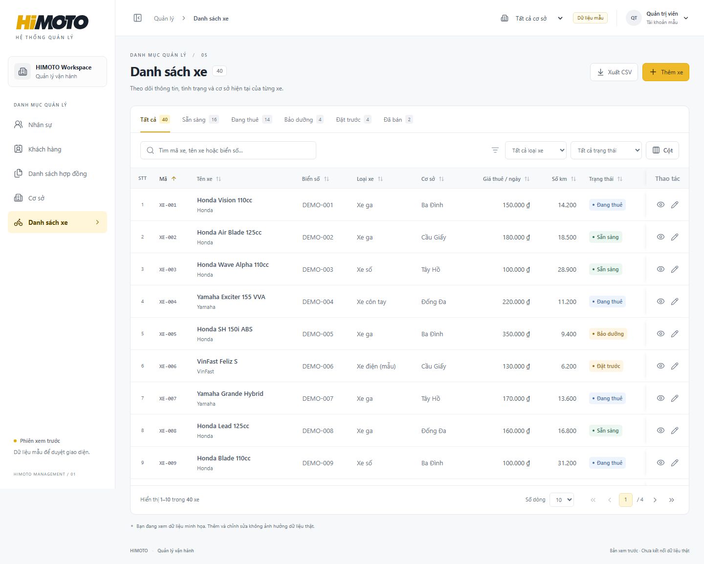

# HIMOTO Management

Frontend Next.js + TypeScript cho các màn dạng bảng: Nhân sự, Khách hàng, Hợp đồng (tra cứu, sao chép, sửa và in nháp), Cơ sở, Danh sách xe và Sổ quỹ / Sổ két.

Demo: **https://himoto-management.vercel.app**. Repo private: https://github.com/huybitvvt/himoto-management. Vercel đã kết nối repo, nhánh `main`.

```bash
npm ci
npm run dev
npm run typecheck
npm run lint:management
npm run test:management
npm run test:contracts
npm run test:clone
npm run test:cashbook
npm run build
```

Mở http://localhost:3000. Mặc định dùng dữ liệu mẫu; thêm/sửa chỉ giữ trong phiên xem trước, không ghi database. Không có backend hay secret trong repo này. Backend dự kiến NestJS, giữ database hiện có.

Module đơn thuê xe không được xây dựng lại. Liên kết mở ứng dụng hiện có qua `NEXT_PUBLIC_RENTAL_APP_URL`. Component đọc chi tiết của module cũ được dùng lại.

Tại **Danh sách hợp đồng → Điền và in hợp đồng**, chọn cơ sở để lọc dropdown nhân sự; nhập `DEMO-000001` để thử auto-fill toàn bộ hồ sơ khách hàng. CCCD 12 số / CMND 9 số chưa có sẽ mở popup tạo khách hàng ngay tại màn hình. Mẫu in cũ A4 ngang được chuyển nguyên nội dung/bố cục, tự đổ thông tin và có phụ lục khi chọn nhiều xe. Có thể in hoặc lưu PDF bằng hộp thoại in. Bản soạn là nháp, không cấp số hoặc tạo đơn thuê xe.

Nút **Sao chép hợp đồng** tạo ngay bản ghi mẫu có ID/mã mới, giữ nguyên dữ liệu và mở form sửa. Lưu giữ cả hồ sơ khách, nhiều xe và thông tin in; mở lại không bị ghi đè bởi danh mục. Khách hàng có **Blacklist (khách nợ xấu)** và dropdown cơ sở từ danh mục chung, gồm cả popup thêm khách trên hợp đồng. Xem [chi tiết sao chép và trường khách hàng](docs/contract-clone.md).

**Sổ quỹ / Sổ két** tại `/cashbook` có hai bảng Phiếu thu/Phiếu chi với cùng bảy cột: ID, Ngày, Giờ, Loại phiếu, Người thực hiện, Lý do, Nội dung. Tìm kiếm và bộ lọc chung, sắp xếp/phân trang riêng; xuất CSV và cuộn ngang bảng trên điện thoại. Xem [giao diện và API chỉ đọc](docs/cashbook.md).

Cấu hình Vercel đã có trong `vercel.json`, chạy `vercel --prod`. Bản công khai chỉ dùng dữ liệu mẫu. API thật cần tích hợp và xác minh DTO trước khi bật. Xem [ghi chú triển khai và API](docs/implementation.md), [ảnh giao diện](docs/qa).

Kiểm tra browser (cần Python Playwright và Chromium): `python scripts/check-management-ui.py --output docs/qa`, `python scripts/preview-management-ui.py --output docs/qa`.

Kiểm tra auto-fill/in: `python scripts/check-contract-ui.py --url http://localhost:3000` (cần thêm PyMuPDF: `pip install pymupdf`). Xem [chi tiết tích hợp](docs/contract-autofill.md).

Kiểm tra sao chép và trường khách hàng: `python scripts/check-contract-clone-ui.py --url http://localhost:3000`. Kết quả: 7 nhóm dữ liệu và 8 nhóm tương tác mới đạt; 11 nhóm auto-fill/in và 8 nhóm danh mục hồi quy đạt.

Kiểm tra sổ quỹ: `python scripts/check-cashbook-ui.py --url http://localhost:3000`. Kết quả: 6 nhóm dữ liệu/adapter và 7 nhóm tương tác đạt.

Đã kiểm tra bản production: build, TypeScript, lint, 8 kiểm tra dữ liệu/adapter, 8 nhóm tương tác, 5 màn ở desktop 1440px và mobile 375px. Không phát hiện lỗi JavaScript hoặc request ghi API trong các ca đã chạy.


